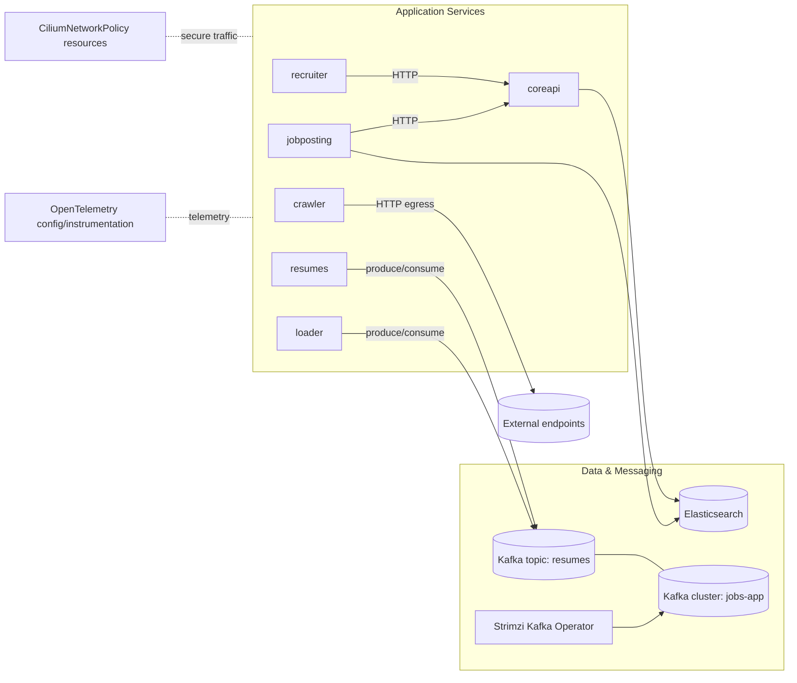

# jobs-app Helm chart
This repository contains the `jobs-app` Helm chart (`Chart.yaml` version `0.12.1`) used to deploy a demo job platform and supporting infrastructure on Kubernetes.

## What the app does
`jobs-app` simulates a multi-service hiring platform and background traffic for Kubernetes demos.

- `coreapi` is the central API.
- `recruiter` and `jobposting` call `coreapi` over HTTP.
- `jobposting` and `coreapi` use Elasticsearch.
- `resumes` and `loader` use Kafka.
- `crawler` generates periodic outbound traffic (and can optionally simulate suspicious behavior).

This makes the app useful for observability demos, service-to-service flow validation, and network policy testing.

## Architecture diagram


## What gets deployed
- Application components:
  - `recruiter` (HTTP :9080)
  - `jobposting` (HTTP :9080)
  - `coreapi` (HTTP :9080)
  - `crawler`
  - `resumes`
  - `loader` (gRPC :50051)
- Data/messaging dependencies:
  - Strimzi Kafka Operator + Kafka cluster (`jobs-app`)
  - Elasticsearch
  - Kafka topic `resumes`
- Cilium network policies (when enabled)

## Prerequisites
- Kubernetes cluster
- Helm 3+
- Cilium installed if `networkPolicy.enabled=true` (default), because this chart creates `CiliumNetworkPolicy` resources
- Enough cluster resources for:
  - Kafka + Zookeeper PVCs (default 10Gi each, storage class `gp2`)
  - Elasticsearch PVC (default 10Gi, storage class `gp2`)

## Install
From this directory:

```bash
helm dependency build .
helm upgrade --install jobs-app . --namespace tenant-jobs --create-namespace
```

## Verify deployment
```bash
kubectl get pods -n tenant-jobs
kubectl get svc -n tenant-jobs
kubectl get kafkas.kafka.strimzi.io -n tenant-jobs
kubectl get kafkatopics.kafka.strimzi.io -n tenant-jobs
```

## Access services locally (port-forward examples)
```bash
kubectl port-forward -n tenant-jobs svc/recruiter 9080:9080
kubectl port-forward -n tenant-jobs svc/coreapi 9081:9080
kubectl port-forward -n tenant-jobs svc/jobposting 9082:9080
kubectl port-forward -n tenant-jobs svc/loader 50051:50051
```

## Key configuration values
All defaults are in `values.yaml`.

- Images/tags:
  - `recruiter.image.*`
  - `jobposting.image.*`
  - `coreapi.image.*`
  - `crawler.image.*`
  - `resumes.image.*`
  - `loader.image.*`
- Core API behavior:
  - `coreapi.errorRate`
  - `coreapi.sleepRate`
  - `coreapi.sleepLowerBound`
  - `coreapi.sleepUpperBound`
- Crawler behavior:
  - `crawler.crawlFrequencyLowerBound`
  - `crawler.crawlFrequencyUpperBound`
  - `crawler.http.enabled`
  - `crawler.http.url`
  - `crawler.revshell.*`
- Tracing:
  - `tracing.enabled`
  - `tracing.otlpExporterEnabled`
  - `tracing.otlpExporterHTTPEndpoint`
  - `tracing.otlpExporterGRPCEndpoint`
- Network policy:
  - `networkPolicy.enabled`
  - `networkPolicy.enable*` toggles for DNS/HTTP/Kafka/Otel behavior

## Common overrides
Create a custom values file (example `values-local.yaml`) and install with `-f values-local.yaml`.

Example:
```yaml
networkPolicy:
  enabled: false

elasticsearch:
  enabled: false

strimzi-kafka-operator:
  enabled: true
```

Apply:
```bash
helm upgrade --install jobs-app . -n tenant-jobs -f values-local.yaml
```

## Upgrade / uninstall
```bash
helm upgrade jobs-app . -n tenant-jobs
helm uninstall jobs-app -n tenant-jobs
```

## Notes
- Two helper scripts exist:
  - `error-isovalent.sh`
  - `no-error-isovalent.sh`
- They currently reference an absolute chart path (`/Users/alecchamberlain/jobs-app`). Update that path if you want to use them from this repo location.
